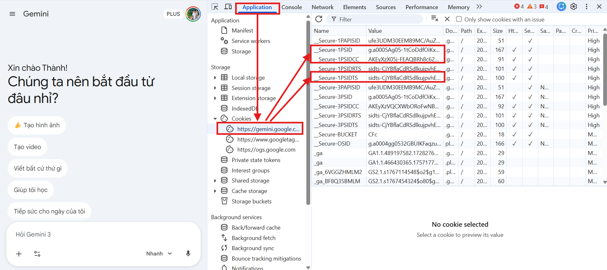
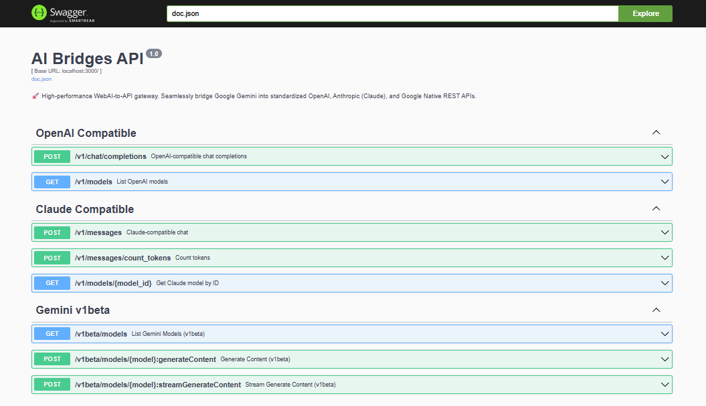

# AI Bridges 🚀

**AI Bridges** transforms Google Gemini web interface into a standardized REST API. Access Gemini's power without API keys - just use your cookies!

[](https://golang.org/)
[](https://github.com/ntthanh2603/ai-bridges/pkgs/container/ai-bridges)
[](https://gemini.google.com)
[](https://github.com/ntthanh2603/ai-bridges/blob/main/LICENSE)

---

## 🎯 Why AI Bridges?

**Problem**: You want to use Google Gemini's latest models, but you don't have an API key or prefer not to use one.

**Solution**: AI Bridges creates a local API server that:

- ✅ Connects to Gemini's web interface using your browser cookies
- ✅ Exposes a Gemini API endpoint
- ✅ No API keys needed - just cookies from your browser
- ✅ Handles authentication and session management automatically

**Use Cases**:

- Use Gemini without API keys
- Test Gemini integration locally
- Build applications leveraging Gemini's latest models
- Develop with cookie-based authentication

---

## ⚡ Quick Start (30 seconds)

### Option 1: Docker Compose (Recommended)

1. **Get your Gemini cookies** (one-time setup):
   - Go to [gemini.google.com](https://gemini.google.com) and sign in
   - Press `F12` → **Application** tab → **Cookies**
   - Copy `__Secure-1PSID` and `__Secure-1PSIDTS`

   

2. **Create `docker-compose.yml`**:

```yaml
services:
  ai-bridges:
    image: ghcr.io/ntthanh2603/ai-bridges:latest
    container_name: ai-bridges
    ports:
      - "3000:3000"
    environment:
      - GEMINI_1PSID=your_1psid_here
      - GEMINI_1PSIDTS=your_1psidts_here
      - GEMINI_REFRESH_INTERVAL=30
      - APP_ENV=production
    volumes:
      - ./cookies:/home/appuser/.cookies
    restart: unless-stopped
```

3. **Start the server**:

```bash
docker-compose up -d
```

4. **Test it**:

```bash
curl -X POST http://localhost:3000/openai/v1/chat/completions \
  -H "Content-Type: application/json" \
  -d '{"model": "gemini-pro", "messages": [{"role": "user", "content": "Hello!"}]}'
```

5. **Done!** Your AI bridge is running at `http://localhost:3000`

### Option 2: Docker Run

```bash
docker run -d -p 3000:3000 \
  -e GEMINI_1PSID="your_psid_here" \
  -e GEMINI_1PSIDTS="your_psidts_here" \
  -e GEMINI_1PSIDCC="your_psidcc_here" \
  -e GEMINI_REFRESH_INTERVAL=30 \
  -e APP_ENV=production \
  -v ./cookies:/home/appuser/.cookies \
  --tmpfs /tmp:rw,size=512m \
  --tmpfs /home/appuser/.cache:rw,size=256m \
  --name ai-bridges \
  --restart unless-stopped \
  ghcr.io/ntthanh2603/ai-bridges:latest
```

---

## ✨ Features

- 🌉 **Universal AI Bridge**: One server, three protocols (OpenAI, Claude, Gemini)
- 🔌 **Drop-in Replacement**: Works with existing OpenAI/Claude/Gemini SDKs
- 🔄 **Smart Session Management**: Auto-rotates cookies to keep sessions alive
- ⚡ **High Performance**: Built with Go and Fiber for speed
- 🐳 **Production Ready**: Docker support, Swagger UI, health checks
- 📝 **Well Documented**: Interactive API docs at `/swagger/`

---

## 🛠️ Configuration

### Environment Variables

| Variable                  | Required | Default | Description                             |
| ------------------------- | -------- | ------- | --------------------------------------- |
| `GEMINI_1PSID`            | ✅ Yes   | -       | Main session cookie from Gemini         |
| `GEMINI_1PSIDTS`          | ✅ Yes   | -       | Timestamp cookie (prevents auth errors) |
| `GEMINI_1PSIDCC`          | ✅ Yes   | -       | Context cookie (optional)               |
| `GEMINI_REFRESH_INTERVAL` | ❌ No    | 30      | Cookie rotation interval (minutes)      |
| `PORT`                    | ❌ No    | 3000    | Server port                             |

### Configuration Priority

1. **Environment Variables** (Highest)
2. **`.env`** file
3. **Defaults** (Lowest)

---

## 🧪 Usage Examples

### OpenAI SDK (Python)

```python
from openai import OpenAI

client = OpenAI(
    base_url="http://localhost:3000/openai/v1",
    api_key="not-needed"
)

response = client.chat.completions.create(
    model="gemini-pro",
    messages=[{"role": "user", "content": "Hello!"}]
)
print(response.choices[0].message.content)
```

### Claude SDK (Python)

```python
from langchain_anthropic import ChatAnthropic

llm = ChatAnthropic(
    base_url="http://localhost:3000/claude",
    model="claude-3-5-sonnet-20240620",
    api_key="not-needed"
)

response = llm.invoke("Explain quantum computing")
print(response.content)
```

### Gemini Native SDK (Python)

```python
import google.generativeai as genai

genai.configure(
    api_key="not-needed",
    transport="rest",
    client_options={"api_endpoint": "http://localhost:3000/gemini"}
)

model = genai.GenerativeModel("gemini-pro")
response = model.generate_content("Write a poem about coding")
print(response.text)
```

### cURL (Direct HTTP)

```bash
curl -X POST http://localhost:3000/openai/v1/chat/completions \
  -H "Content-Type: application/json" \
  -d '{
    "model": "gemini-pro",
    "messages": [{"role": "user", "content": "What is AI?"}],
    "stream": false
  }'
```

**More examples**: Check the [`examples/`](examples/) directory for complete working code.

---

## 🔧 Building from Source

If you want to modify the code or contribute:

```bash
# Clone the repository
git clone https://github.com/ntthanh2603/ai-bridges.git
cd ai-bridges

# Copy and configure
cp .env.example .env
# Edit .env with your cookies

# Run locally
go run cmd/server/main.go

# Or build binary
go build -o ai-bridges cmd/server/main.go
./ai-bridges
```

---

## 📘 API Documentation

Once running, visit **`http://localhost:3000/swagger/index.html`** for interactive API documentation.



---

## 🤝 Contributing

Contributions are welcome! Please feel free to submit a Pull Request.

1. Fork the repository
2. Create your feature branch (`git checkout -b feature/amazing-feature`)
3. Commit your changes (`git commit -m 'Add some amazing feature'`)
4. Push to the branch (`git push origin feature/amazing-feature`)
5. Open a Pull Request

---

## 📄 License

This project is licensed under the MIT License - see the [LICENSE](LICENSE) file for details.

---

## ⭐ Star History

If you find this project useful, please consider giving it a star! ⭐

---

## 🔗 Links

- **GitHub**: [ntthanh2603/ai-bridges](https://github.com/ntthanh2603/ai-bridges)
- **Gemini Web**: [gemini.google.com](https://gemini.google.com)
- **Docker Hub**: [ghcr.io/ntthanh2603/ai-bridges](https://github.com/ntthanh2603/ai-bridges/pkgs/container/ai-bridges)
- **Issues**: [Report a bug](https://github.com/ntthanh2603/ai-bridges/issues)

---

**Made with ❤️ by the AI Bridges team**
