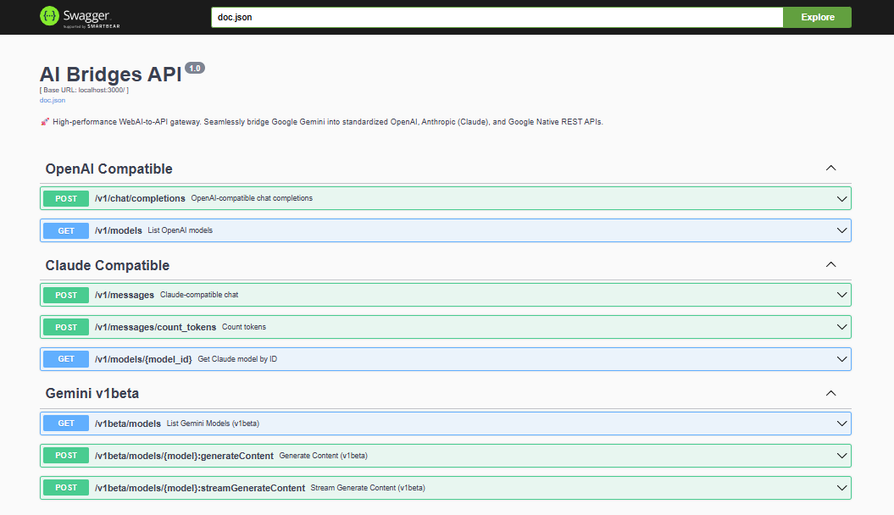

<p align="center">
  
</p>

<p align="center">
  <a href="https://github.com/ntthanh2603/gemini-web-to-api/releases"></a>
  <a href="https://golang.org/"></a>
  <a href="https://www.docker.com/"></a>
  <a href="https://github.com/ntthanh2603/gemini-web-to-api/pkgs/container/gemini-web-to-api"></a>
  <a href="https://github.com/ntthanh2603/gemini-web-to-api/blob/main/LICENSE"></a>
  
</p>

<p align="center">
  <a href="https://github.com/ntthanh2603/gemini-web-to-api/stargazers"></a>
  <a href="https://github.com/ntthanh2603/gemini-web-to-api/issues"></a>
  
</p>

<h1 align="center">Gemini Web To API 🚀</h1>

<p align="center">
  Transforms Google Gemini web interface into a standardized REST API.<br/>
  Access Gemini's power without API keys — just use your cookies!
</p>

<p align="center">
  <b>Created with ❤️ by <a href="https://github.com/ntthanh2603">@ntthanh2603</a></b>
</p>

> [!NOTE]
> This project is intended for **research and educational purposes only**. Please use responsibly and refrain from any commercial use.

> [!WARNING]
> This project is not affiliated with Google. It uses reverse-engineered web cookies and may not comply with [Google's Terms of Service](https://policies.google.com/terms). Use at your own risk — the author assumes no responsibility for any account actions or data loss.

---

## 🎯 Why Gemini Web To API?

**Problem**: You want to use Google Gemini's latest models, but you don't have an API key or prefer not to use one.

**Solution**: Creates a local API server that:

- ✅ Connects to Gemini's web interface using your browser cookies
- ✅ Exposes OpenAI / Claude / Gemini-compatible API endpoints
- ✅ No API keys needed — just cookies from your browser
- ✅ Handles authentication and session management automatically

**Use Cases**:

- Use Gemini without API keys
- Test Gemini integration locally
- Build applications leveraging Gemini's latest models
- Develop with cookie-based authentication

---

## ⚡ Quick Start

### 🐳 Option A — Docker Run (no setup required)

> No cloning needed — pull and run directly from the registry.

**Step 1 — Get your cookies**

> [!WARNING]
> Keep these values secure and **never share or commit them** — they provide direct access to your Google account.

1. Go to [gemini.google.com](https://gemini.google.com) and sign in
2. Press `F12` → **Network**, reload Gemini, and select a
   `batchexecute?rpcids=otAQ7b` request
3. Copy its complete `Cookie` request header. If the request URL contains an
   account slot such as `/u/2/`, also use `GEMINI_AUTH_USER="2"` below.

**Step 2 — Run**

```bash
docker run -d -p 4981:4981 \
  -e GEMINI_COOKIES="your_complete_cookie_header" \
  -e GEMINI_AUTH_USER="2" \
  -e GEMINI_REFRESH_INTERVAL=30 \
  -e GEMINI_MAX_RETRIES=3 \
  -e GEMINI_TEMPORARY=false \
  -e APP_ENV=production \
  -e RATE_LIMIT_ENABLED=true \
  -e RATE_LIMIT_WINDOW_MS=60000 \
  -e RATE_LIMIT_MAX_REQUESTS=10 \
  -v ./cookies:/home/appuser/.cookies \
  --tmpfs /tmp:rw,size=512m \
  --tmpfs /home/appuser/.cache:rw,size=256m \
  --name gemini-web-to-api \
  --restart unless-stopped \
  ghcr.io/ntthanh2603/gemini-web-to-api:latest
```

**Done!** Jump to [Test it](#-test-it). 🎉

---

### 🛠️ Option B — Build from source

> Use this if you want to build for a specific architecture (amd64, arm64, etc.) or modify the source code.

**Step 1 — Clone the repository**

```bash
git clone https://github.com/ntthanh2603/gemini-web-to-api.git
cd gemini-web-to-api
```

**Step 2 — Get your cookies and configure `.env`**

> [!WARNING]
> Keep these values secure and **never commit your `.env` file** — it contains credentials that provide access to your Google account.

1. Go to [gemini.google.com](https://gemini.google.com) and sign in
2. Press `F12` → **Network**, reload Gemini, and select a
   `batchexecute?rpcids=otAQ7b` request
3. Copy its complete `Cookie` request header into `GEMINI_COOKIES`.
4. Match `GEMINI_AUTH_USER` to the request URL. For example, use `2` when the
   URL contains `/u/2/`; leave it empty when there is no `/u/<number>/`.
   Always take the cookie and account slot from the same browser tab.
5. Create your `.env` from the example:

   ```bash
   cp .env.example .env
   ```

6. Paste the values into `.env`:

   ```env
   GEMINI_COOKIES=your_complete_cookie_header
   GEMINI_AUTH_USER=2
   GEMINI_REFRESH_INTERVAL=30
   GEMINI_MAX_RETRIES=3
   GEMINI_TEMPORARY=false
   APP_ENV=production
   RATE_LIMIT_ENABLED=true
   RATE_LIMIT_WINDOW_MS=60000
   RATE_LIMIT_MAX_REQUESTS=10
   ```

**Step 3 — Run**

Pick whichever method suits your setup:

| Method             | Command                        | Requirements                                                                                |
| ------------------ | ------------------------------ | ------------------------------------------------------------------------------------------- |
| 🐳 Docker Compose  | `docker compose up -d --build` | Docker                                                                                      |
| 🐹 Go direct       | `go run cmd/server/main.go`    | [Go 1.21+](https://golang.org/dl/)                                                          |
| ⚡ Task (dev mode) | `task dev`                     | [Task](https://taskfile.dev) + [Air](https://github.com/air-verse/air) (`task install-air`) |

> `task dev` runs the server with **hot reload**: Air rebuilds and restarts it whenever a `.go`, `.json` or `.env` file changes (config in `.air.toml`).

**Done!** Jump to [Test it](#-test-it). 🎉

---

### ✅ Test it

```bash
curl -X POST http://localhost:4981/openai/v1/chat/completions \
  -H "Content-Type: application/json" \
  -d '{"model": "gemini-advanced", "messages": [{"role": "user", "content": "Hello!"}]}'
```

Your Gemini Web To API is running at `http://localhost:4981` 🎉

---

## ✨ Features

- 🌉 **Universal AI Bridge**: One server, three protocols (OpenAI, Claude, Gemini)
- 🔌 **Drop-in Replacement**: Works with existing OpenAI / Claude / Gemini SDKs
- 🔄 **Smart Session Management**: Auto-rotates cookies to keep sessions alive
- ⚡ **High Performance**: Built with Go and Fiber for speed
- 🐳 **Production Ready**: Docker Compose support, Scalar UI, health checks
- 📝 **Well Documented**: Interactive API docs at `/docs`
- 🖼️ **Image Generation**: OpenAI-compatible text-to-image with authenticated `b64_json` output
- 🧩 **Image Inputs**: Remote URLs, `data:` URLs and multiple reference images in chat requests
- 🎬 **Video Generation**: Text-to-video (16:9 or 9:16 MP4) via Gemini Web's Videos tool, usable from the OpenAI (`client.videos`) and Google GenAI (`generate_videos`) SDKs
- 🧾 **Canvas**: Gemini Canvas code files and documents via any chat API — just use a `-canvas` model (e.g. `gemini-pro-canvas`)

See [Image generation and image inputs](docs/image-generation.md) for tested examples, limitations and security guidance.
See [Video generation](docs/video-generation.md) for the video APIs and the [OpenAI](examples/openai_video_client.py) / [Gemini](examples/gemini_video_client.py) SDK examples.
See [Canvas](docs/canvas.md) and the [OpenAI](examples/openai_canvas_client.py) / [Gemini](examples/gemini_canvas_client.py) / [Claude](examples/claude_canvas_client.py) SDK examples for canvas mode.

---

## 🛠️ Configuration

### Environment Variables

| Variable                  | Required | Default | Description                                                      |
| ------------------------- | -------- | ------- | ---------------------------------------------------------------- |
| `GEMINI_COOKIES`          | ✅ Yes   | —       | Complete Cookie request header copied from the Gemini Web tab    |
| `GEMINI_AUTH_USER`        | ❌ No    | —       | Google account slot from the Gemini URL, e.g. `2` for `/u/2/app` |
| `GEMINI_REFRESH_INTERVAL` | ❌ No    | `30`    | Cookie rotation interval (minutes)                               |
| `GEMINI_MAX_RETRIES`      | ❌ No    | `3`     | Max retry attempts when an API call fails                        |
| `GEMINI_TEMPORARY`        | ❌ No    | `false` | Enable stateless/incognito mode for all requests                 |
| `PORT`                    | ❌ No    | `4981`  | Server port                                                      |
| `RATE_LIMIT_ENABLED`      | ❌ No    | `false` | Enable or disable rate limiting                                  |
| `RATE_LIMIT_WINDOW_MS`    | ❌ No    | `60000` | Rate limit time window in milliseconds                           |
| `RATE_LIMIT_MAX_REQUESTS` | ❌ No    | `10`    | Maximum number of requests allowed per time window               |

### Configuration Priority

1. **Environment Variables** (highest priority)
2. **`.env` file**
3. **Defaults** (lowest priority)

---

## 🧪 Usage Examples

### Model selection

The provider discovers selectable models and their internal IDs from the signed-in account's Gemini Web model registry during session initialization and refresh. List the current choices with:

```bash
curl http://localhost:4981/openai/v1/models
```

Use a returned model ID in your requests. IDs are derived from Gemini's current
display labels, such as `gemini-3.6-flash` and `gemini-3.1-pro`; they are not a
fixed allowlist. Every selectable registry entry is returned, so newly added
Gemini models become available without a code update. Category names returned
by Gemini remain aliases, and `gemini-advanced` is retained as a compatibility
alias for the discovered Pro category. An unavailable or unknown name returns
an error instead of silently selecting another model.

Model names are not seeded locally. When Google adds, removes, or renames a model, use the names returned by this endpoint instead of relying on old Gemini API version names.

The `model` field in a completion response contains the resolved versioned
model ID (for example, a `gemini-advanced` request currently returns
`gemini-3.1-pro`). Generated self-introductions are ordinary model output and
can still be inaccurate.

Gemini Web may silently serve a lower-tier model after the selected model's
quota is exhausted. The proxy detects an unambiguous different model ID in the
protocol response and reports that model in `model`. The original caller value
is preserved in `requested_model`. This keeps the response truthful without
blocking a model that Gemini still advertises as selectable; after its quota
resets, `model` returns to the requested version.

### OpenAI SDK (Python)

```python
from openai import OpenAI

client = OpenAI(
    base_url="http://localhost:4981/openai/v1",
    api_key="not-needed"
)

response = client.chat.completions.create(
    model="gemini-advanced",
    messages=[{"role": "user", "content": "Hello!"}]
)
print(response.choices[0].message.content)
```

### Claude SDK (Python)

```python
from langchain_anthropic import ChatAnthropic

llm = ChatAnthropic(
    base_url="http://localhost:4981/claude",
    model="gemini-advanced",
    api_key="not-needed"
)

response = llm.invoke("Explain quantum computing")
print(response.content)
```

### Gemini Native SDK (Python)

```python
from google import genai

client = genai.Client(
    api_key="not-needed",
    http_options={
        "base_url": "http://localhost:4981/gemini",
        "api_version": "v1beta",
    },
)

response = client.models.generate_content(
    model="gemini-advanced",
    contents="Write a poem about coding",
)
print(response.text)
```

Install the maintained SDK with `pip install google-genai`. Both regular
generation and `generate_content_stream` are supported; the latter uses the
SDK's `alt=sse` transport.

### cURL

```bash
curl -X POST http://localhost:4981/openai/v1/chat/completions \
  -H "Content-Type: application/json" \
  -d '{
    "model": "gemini-advanced",
    "messages": [{"role": "user", "content": "What is AI?"}],
    "stream": false
  }'
```

More examples are available in the [`examples/`](examples/) directory.

---

## 📘 API Documentation

Once running, visit **`http://localhost:4981/docs`** for interactive API documentation powered by [Scalar](https://scalar.com).



---

## 🤝 Contributing

Contributions are welcome! Please feel free to submit a Pull Request.

1. Fork the repository
2. Create your feature branch (`git checkout -b feature/amazing-feature`)
3. Commit your changes (`git commit -m 'Add some amazing feature'`)
4. Push to the branch (`git push origin feature/amazing-feature`)
5. Open a Pull Request

---

## 👤 Author

- **Nguyễn Tuấn Thành** ([@ntthanh2603](https://github.com/ntthanh2603))

---

## 📄 License

This project is licensed under the MIT License — see the [LICENSE](LICENSE) file for details.

---

## ⭐ Star History

If you find this project useful, please consider giving it a star! ⭐

---

## 🔗 Links

- **GitHub**: [ntthanh2603/gemini-web-to-api](https://github.com/ntthanh2603/gemini-web-to-api)
- **Gemini Web**: [gemini.google.com](https://gemini.google.com)
- **Issues**: [Report a bug](https://github.com/ntthanh2603/gemini-web-to-api/issues)

---

**Created with ❤️ by [@ntthanh2603](https://github.com/ntthanh2603)**
